# Pepper_DRL_MAExploration
This repository uses Deep Reinforcement Learning (DRL) with Imitation Learning (IL) using A3C (Asynchronous Advantage Actor Critic) Algorithm to train multiple-agents to perform Exploration of an uncharted area in a coordinated and decentralized fashion. The simulation environment is custom built entirely on ROS (Robot Operating System), and the environment is capable of:
1) Generating random maps and spawn multiple agents
2) Obtain Laser Scan around the agents and perform SLAM (Simultaneous Localization And Mapping) with gmapping
3) Communicate the built maps with the nearby agents within communication range
4) Perform point to point navigation using Global Planner
5) Perform autonomous exploration using Frontier, RRT (Rapidly exploring Random Tree) and Hector Exploration ROS Packages, which are used as experts that generate paths to train the DRL network using Imitation Learning.

## Getting Started ##
### System Requirements: ###
1) Ubuntu 16.04 (Xenial Xerus) OS
2) ROS Kinetic Kame Framework
3) Python 2.7
4) Tensorflow 1.11

### Setting up the Environment: ###
1) Create a catkin workspace and clone all the contents in `/catkin_ws/src` directory of this repository into its source folder. And then run the `catkin_make` command.
2) Install OpenAI Gym: `pip instal gym`, and run the following commands to install the custom environment:
   ```
   cd custom_gym
   pip install -e .
   ```
   If you wish to uninstall the environment later for reasons like changing the source directory, you can run the following:
   ```
   pip uninstall custom_env
   ```
   More details about installing and uninstalling OpenAI gym custom envs can be found [here](https://medium.com/analytics-vidhya/building-custom-gym-environments-for-reinforcement-learning-24fa7530cbb5)

## Environment ##
### Key Files: ###
1) `/custom_gym/envs/custom_dir/Custom_Env.py` - Containing the Environment, Agents, SLAM and Navigation classes.
2) `Env_sim.py` - Demonstrates the procedure to initialize the Environment and run the Key Functions in it.
3) `Endurance_Test.py` - Debugging file to test if the Environment is set up correctly by initializing and resetting it several times.
4) `/catkin_ws/src/pepper/launch/env_map_merge_global.launch` - ROS launch file that launches the global ROS nodes of an environment (such as global map merger, central RRT exploration planner, etc.), which will be used/shared by all the spawned agents. This launch file is initialized only once in each environment instance.
5) `/catkin_ws/src/pepper/launch/gmapping_simple_sim.launch` - ROS launch file that launches all the ROS nodes specific to each agents (such as gmapping, global planner, exploration packages, etc.). This launch file is initialized everytime an agent is spawned in the environment.
6) `/catkin_ws/src/pepper/src/global_map_merger.py` - Combines the maps explored by all the agents to be fed into the expert exploration packages for Imitation Learning. This ROS node is called by `env_map_merge_global.launch` and has one instance running per environment.
7) `/catkin_ws/src/pepper/src/local_map_receiver.py` - This ROS node is initialized by `gmapping_simple_sim.launch` and has one instance running per agent. This node communicates and combines the maps built by the nearby agents to an agents which are present within the defined communication range.
8) `/catkin_ws/src/pepper/src/occupancy_counter.py` - This ROS node calculates the exploration progress at each step, by counting the no. of explored and unexplored pixels in a map, thereby allowing the environment to decide when exactly to terminate an episode. This node is initialized by both `env_map_merge_global.launch` and `gmapping_simple_sim.launch` to determine the exploration progress of both local and global maps.
9) `/catkin_ws/src/pepper/src/frontier_detector.py` - This ROS node detects and outputs the frontier points using OpenCV in the gmapping generated maps, which would be sent as observation into the DRL network to assist the Agents in making more informed choices on where to head to. This node is initialized by both launch files as well, to detect the frontier points in both maps.

### Parameters: ###
1) `size` - Size of Environment.
2) `obstacle_density` - Density of obstacles to randomly spawn on the Environment.
3) `n_agents` - Number of Agents to spawn in the Environment.
4) `rrt_exp` - Global Flag to set all the agents to explore the map using RRT Exploration expert.
5) `rrt_mode` - Choose one among the 4 modes, the RRT expert operates with (for all the agents).
6) `agents_exp` - Choose if each agent explores using Frontier or Hector Exploration packages (or) can move freely to perform RL instead.
7) `global_map_exp` - Choose if Frontier or Hector Expert packages would use the global combined map of all agents (or) the local in-range communicated maps.
8) `global_planner` - Flag to initialize global planner node required for point-point navigation (must be True if Frontier or RRT experts are used).
9) `laser_range` - Range of Laser Scan sensor of all agents.
10) `max_comm_dist` - Communication range of all agents.
11) `nav_recov_timeout` - Timeout to recover and retry if Global Planner node fails to return a path.

### Functions: ###
1) `step()` - Executes 1 step of the environment (i.e.) 1 step of all agents.
2) `agent[n].observe()` - Outputs the states of agent 'n', to be sent as input to its DRL network.
3) `agent[n].odom_update(x,y)` - Moves agent 'n' to the specified (x,y) coordinate.
4) `agent[n].map_check(x,y)` - Check if agent 'n' is free to move to (x,y) and if an obstacle is not present there.
5) `agent[n].set_goal_pixel(x,y)` - Sets (x,y) pixel as goal for the global_planner to navigate agent 'n' to.
6) `agent[n].move_base.cancel_sub(0)` - Cancel the current goal of global_planner on agent 'n', before completion and halt the agent.
7) `agent[n].switch_to_free_nav()` - Remove association of agent 'n' from the initialized exploration expert and enables the global_planner to take any goals.
8) `agent[n].switch_to_free_move()` - Disables both exploration expert and global_planner() on agent 'n' and restrics the action space to adjacent cell mevements.
9) `agent[n].switch_to_exp()` - Undoes the changes of `switch_to_free_nav()` and/or  function.
10) `render()` - Render the present state of the environment in an OpenCV window.
11) `reset()` - Kill all the Agents in an environment and respawn them at random locations by clearing their maps.
12) `close()` - Deletes the entire environment.

### Key Variables: ###
1) Exploration Progresses: `exp_prog`, `agent[n].exp_prog`, `agent[n].local_exp_prog`
2) Dimensions of map returned by gmapping: `map_width`, `map_height`, `map_length`
3) `agent[n].agent_pos` - Agent 'n's current (x,y) coordinate in the environment.
4) `agent[n].agent_pixel` - Agent 'n's pixel coordinate in the map returned by gmapping.
5) `map` - Global map subscribed from the `global_map_merger.py` node.
6) `agent[n].map` - Local communicated map of agent 'n', subscribed from the `local_map_receiver.py` node.
7) `frontier_map` - Contains the frontier pixels in global map, subscribed from `frontier_detector.py` node.
8) `agent[n].frontier_map` - frontier_map of agent 'n'.
9) `agent[n].last_known_pixel` - Agent 'n's last known locations (in terms of (x,y) in gmapping's map) of every other agent, that came within its communication range.
10) `agent[n].goal_pos` - Agent 'n's latest (x,y) coordinate goal on the environment which is in progress (or) just got completed.
11) `agent[n].goal_pixel` - (x,y) pixel position of `agent[n].goal_pos` in gmapping's map.
12) `agent[n].step_ret` - Denotes if agent 'n' is undergoing active navigation (or) inactive.

# Gallery

## 1) Obstacles Spawn with varying density: ##
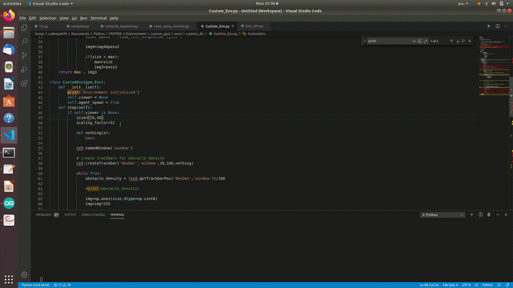

## 2) SLAM - Quick Sweep (with gmapping): ##
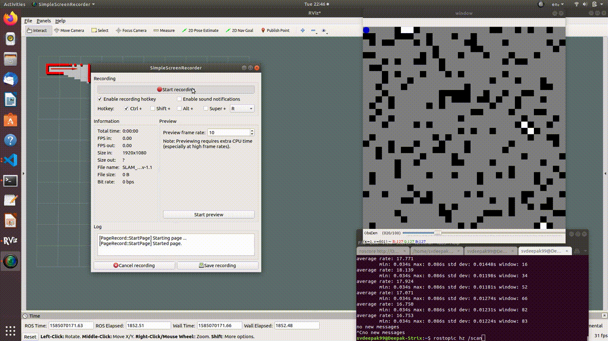
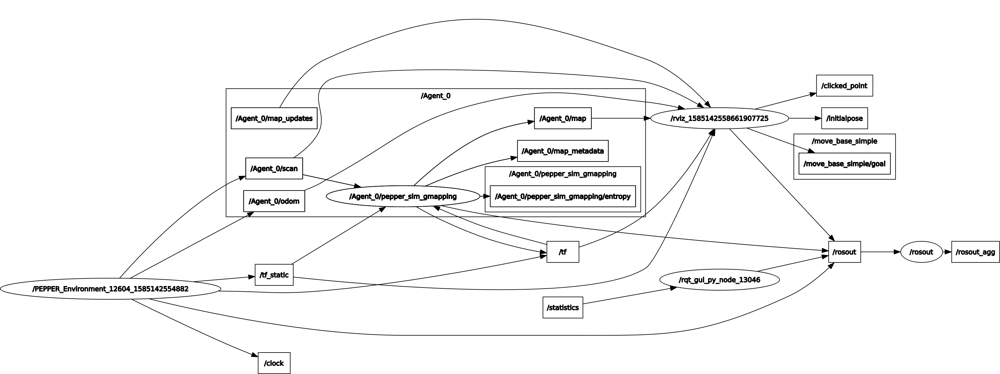

## 3) Map Merging Nodes - Global and Local  (for 4 Agents): ##

### (i) ROS Graph: ###
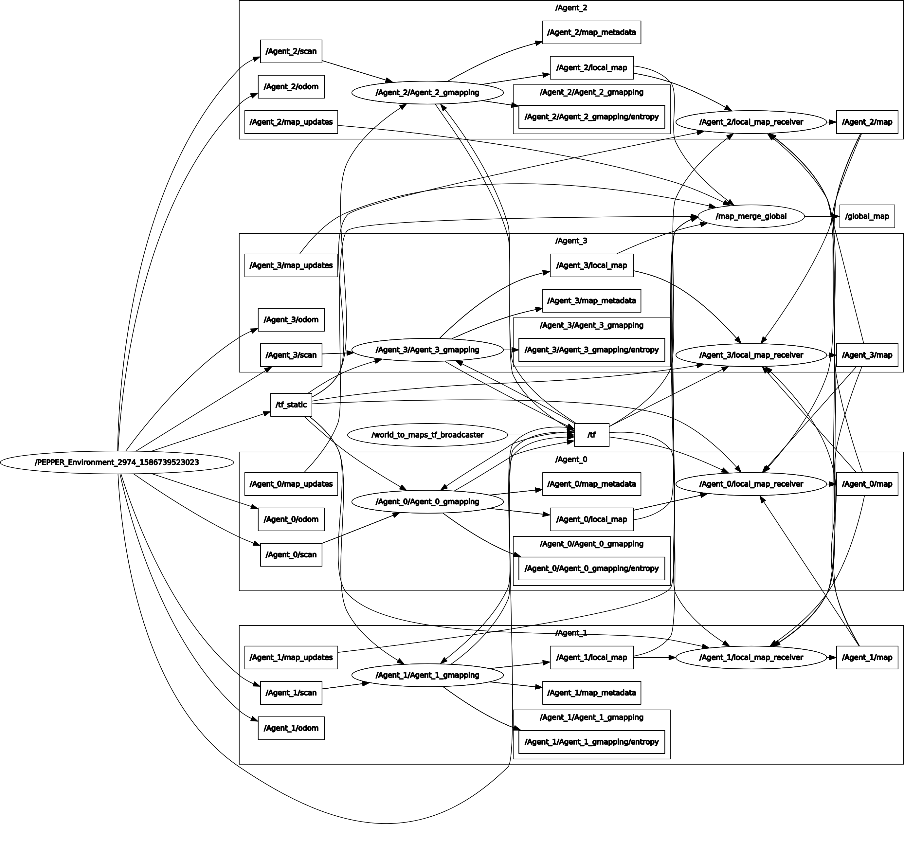

### (ii) ROS Tf tree: ###
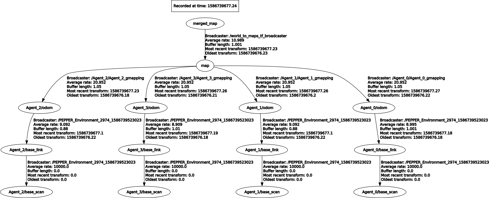

## 4) Navigation - Point to point (with Global Planner): ###
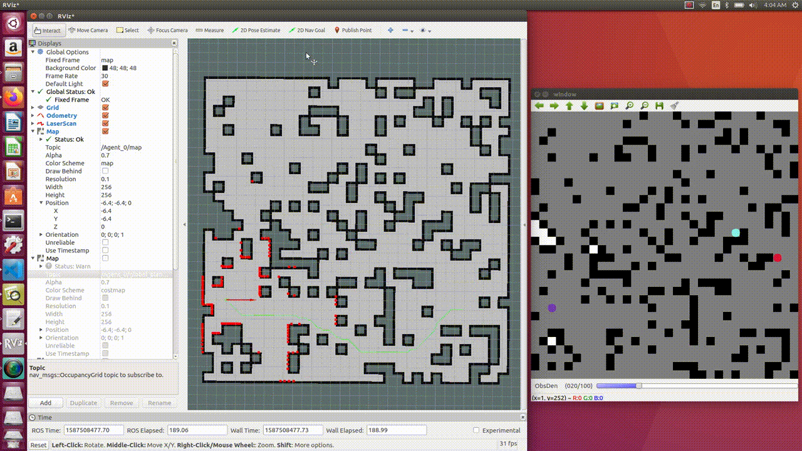

## 5) Frontier Exploration Expert: ##
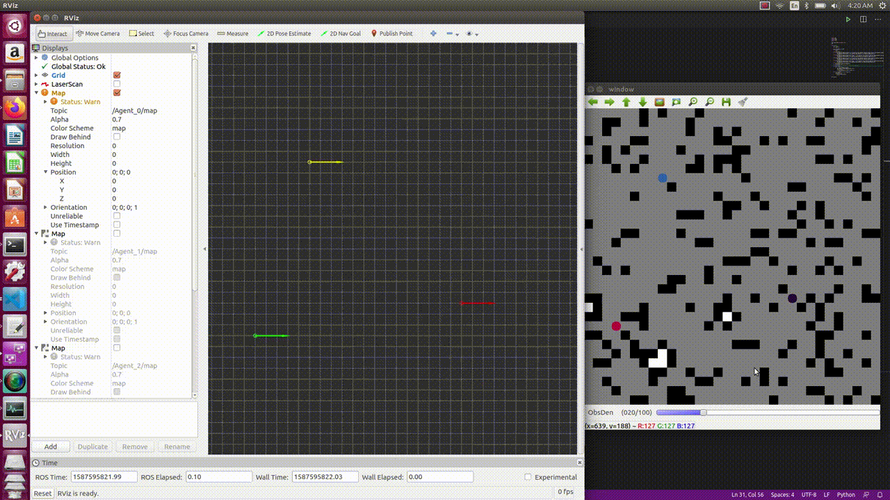
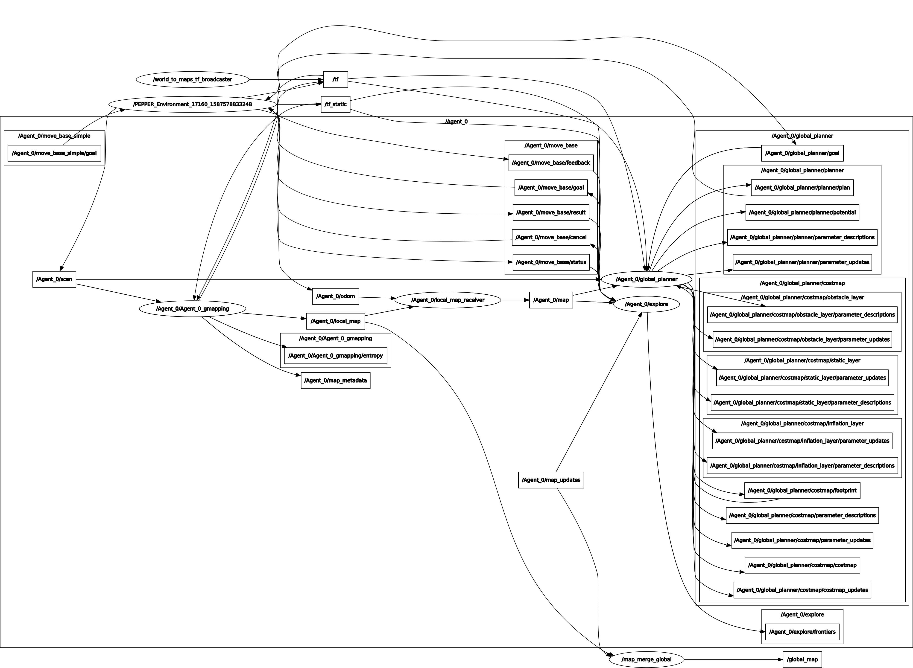

## 6) RRT Exploration Expert: ##
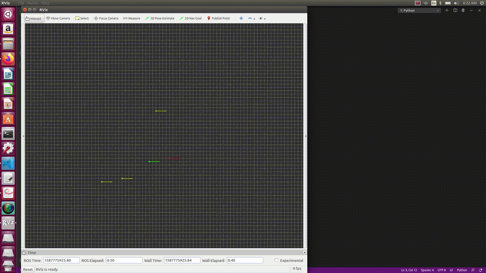

## 7) Hector Exploration Expert: ##

### (i) 32x32 World - 3 Agents: ###
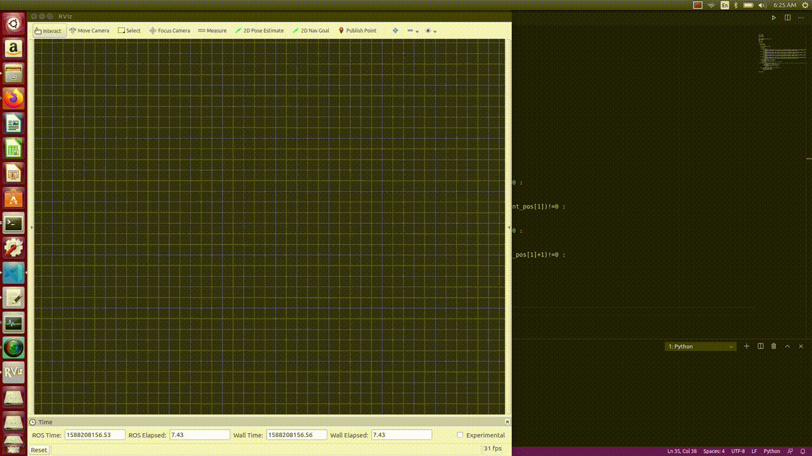

### (ii) 64x64 World - 4 Agents: ###
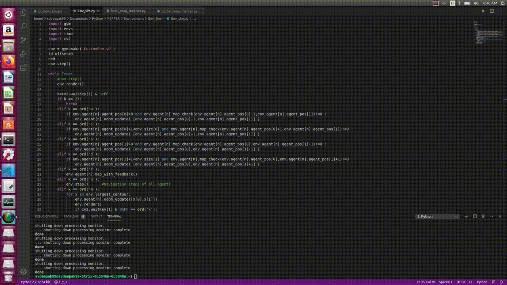

### (iii) 128x128 World - 8 Agents: ###


### (iv) ROS Graph (with 3 Agents): ###
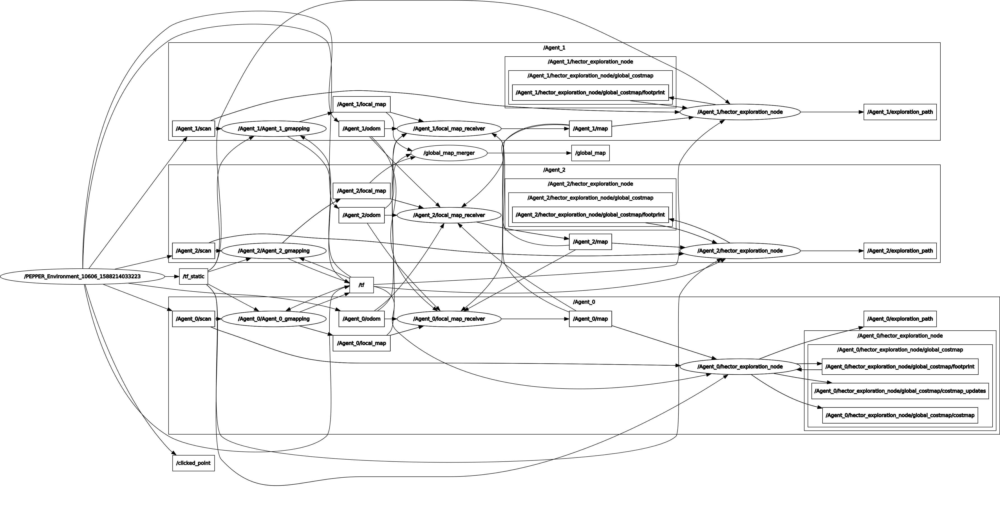

## 8) Simultaneous Multi-Environment Instances: ##
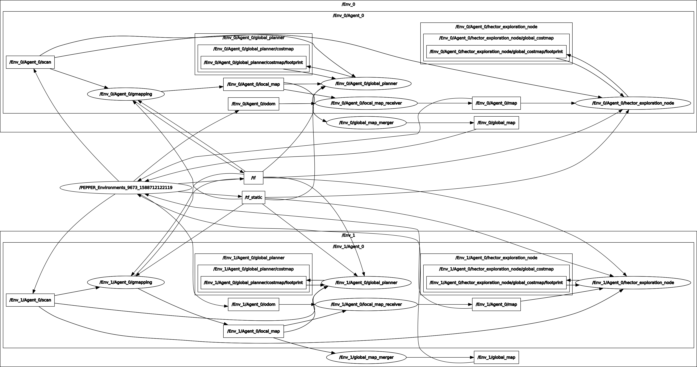
